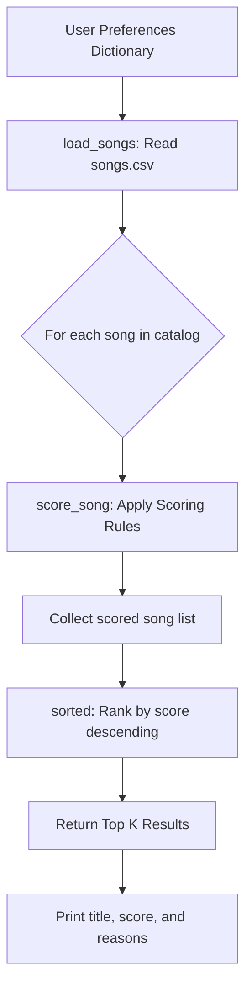

# The Mood Machine

The Mood Machine is a simple text classifier that begins with a rule based approach and can optionally be extended with a small machine learning model. It tries to guess whether a short piece of text sounds **positive**, **negative**, **neutral**, or even **mixed** based on patterns in your data.

This lab gives you hands on experience with how basic systems work, where they break, and how different modeling choices affect fairness and accuracy. You will edit code, add data, run experiments, and write a short model card reflection.

---

## Repo Structure

```plaintext
├── dataset.py         # Starter word lists and example posts (you will expand these)
├── mood_analyzer.py   # Rule based classifier with TODOs to improve
├── main.py            # Runs the rule based model and interactive demo
├── ml_experiments.py  # (New) A tiny ML classifier using scikit-learn
├── model_card.md      # Template to fill out after experimenting
└── requirements.txt   # Dependencies for optional ML exploration
```

---

## Getting Started

1. Open this folder in VS Code.
2. Make sure your Python environment is active.
3. Install dependencies:

    ```bash
    pip install -r requirements.txt
    ```

4. Run the rule-based starter:

    ```bash
    python main.py
    ```

If pieces of the analyzer are not implemented yet, you will see helpful errors that guide you to the TODOs.

To try the ML model later, run:

```bash
python ml_experiments.py
```

---

## What You Will Do

During this lab you will:

- Implement the missing parts of the rule based `MoodAnalyzer`.
- Add new positive and negative words.
- Expand the dataset with more posts, including slang, emojis, sarcasm, or mixed emotions.
- Observe unusual or incorrect predictions and think about why they happen.
- Train a tiny machine learning model and compare its behavior to your rule based system.
- Complete the model card with your findings about data, behavior, limitations, and improvements.
- The goal is to help you reason about how models behave, how data shapes them, and why even small design choices matter.

---

## Tips

- Start with preprocessing before updating scoring rules.
- When debugging, print tokens, scores, or intermediate choices.
- Ask an AI assistant to help create edge case posts or unusual wording.
- Try examples that mislead or confuse your model. Failure cases teach you the most.


---

## Music Recommender Simulation

### How The System Works

Real-world platforms like Spotify combine two main strategies: **collaborative filtering** (recommending what similar users liked) and **content-based filtering** (matching a song's attributes to a user's taste profile). This simulation focuses on content-based filtering because it works without any user history data — just a catalog of songs with measurable attributes and a user preference dictionary.

The flow is:

```
Input (User Preferences)
        |
        v
  Loop over every song in data/songs.csv
        |
        v
  score_song() — compute a weighted score for each song
        |
        v
  sorted() — rank all songs from highest to lowest score
        |
        v
Output (Top K Recommendations with scores and reasons)
```

#### Mermaid Flowchart



#### Algorithm Recipe (Scoring Rules)

| Feature | Rule | Max Points |
|---|---|---|
| Genre match | +2.0 if song genre == user's favorite genre | 2.0 |
| Mood match | +1.0 if song mood == user's favorite mood | 1.0 |
| Energy similarity | +1.5 * (1 - abs(song_energy - target_energy)) | 1.5 |
| Danceability similarity | +1.0 * (1 - abs(song_danceability - target_danceability)) | 1.0 |
| Acousticness similarity | +0.5 * (1 - abs(song_acousticness - target_acousticness)) | 0.5 |
| **Maximum possible** | | **6.0** |

Genre is weighted highest (+2.0) because genre is the broadest filter on musical vibe. Energy is next (+1.5) because high/low energy is often the most defining factor in whether a song fits a moment. Mood and danceability are supporting signals. Acousticness has the smallest weight because it is a secondary texture attribute.

#### Features Used

Each `song` dictionary has:
- `title`, `artist` — identifiers (not used in scoring)
- `genre` — categorical; compared directly to `favorite_genre`
- `mood` — categorical; compared directly to `favorite_mood`
- `energy` — float 0.0–1.0; compared via absolute difference to `target_energy`
- `tempo_bpm` — integer; currently not used in scoring (future improvement)
- `danceability` — float 0.0–1.0; compared to `target_danceability`
- `acousticness` — float 0.0–1.0; compared to `target_acousticness`

Each `UserProfile` dictionary has:
- `favorite_genre`, `favorite_mood` — strings for categorical matching
- `target_energy`, `target_danceability`, `target_acousticness` — floats for continuous similarity scoring

#### Known Potential Bias

- **Genre dominance**: The +2.0 genre bonus means songs from the preferred genre almost always dominate, regardless of other attributes. A genre that is rare in the catalog (like "ambient") gives that user very few good options.
- **Dataset imbalance**: 8 of 20 songs (40%) are pop. Pop profiles get many valid recommendations; niche genre profiles get stranded.
- **No tempo in scoring**: `tempo_bpm` is loaded but not used in scoring — a high-BPM preference has no effect.


