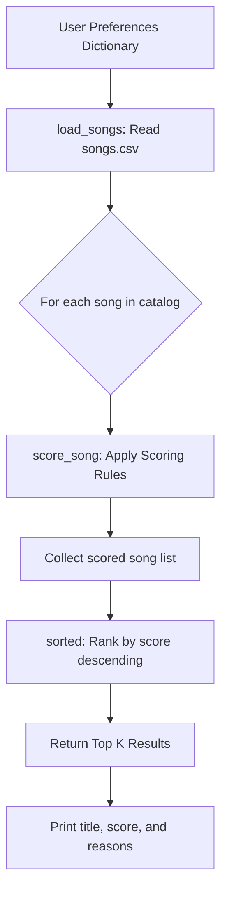

# The Mood Machine

The Mood Machine is a simple text classifier that begins with a rule based approach and can optionally be extended with a small machine learning model. It tries to guess whether a short piece of text sounds **positive**, **negative**, **neutral**, or even **mixed** based on patterns in your data.

This lab gives you hands on experience with how basic systems work, where they break, and how different modeling choices affect fairness and accuracy. You will edit code, add data, run experiments, and write a short model card reflection.

---

## Repo Structure

```plaintext
├── dataset.py         # Starter word lists and example posts (you will expand these)
├── mood_analyzer.py   # Rule based classifier with TODOs to improve
├── main.py            # Runs the rule based model and interactive demo
├── ml_experiments.py  # (New) A tiny ML classifier using scikit-learn
├── model_card.md      # Template to fill out after experimenting
└── requirements.txt   # Dependencies for optional ML exploration
```

---

## Getting Started

1. Open this folder in VS Code.
2. Make sure your Python environment is active.
3. Install dependencies:

    ```bash
    pip install -r requirements.txt
    ```

4. Run the rule-based starter:

    ```bash
    python main.py
    ```

If pieces of the analyzer are not implemented yet, you will see helpful errors that guide you to the TODOs.

To try the ML model later, run:

```bash
python ml_experiments.py
```

---

## What You Will Do

During this lab you will:

- Implement the missing parts of the rule based `MoodAnalyzer`.
- Add new positive and negative words.
- Expand the dataset with more posts, including slang, emojis, sarcasm, or mixed emotions.
- Observe unusual or incorrect predictions and think about why they happen.
- Train a tiny machine learning model and compare its behavior to your rule based system.
- Complete the model card with your findings about data, behavior, limitations, and improvements.
- The goal is to help you reason about how models behave, how data shapes them, and why even small design choices matter.

---

## Tips

- Start with preprocessing before updating scoring rules.
- When debugging, print tokens, scores, or intermediate choices.
- Ask an AI assistant to help create edge case posts or unusual wording.
- Try examples that mislead or confuse your model. Failure cases teach you the most.


---

## Music Recommender Simulation

### How The System Works

Real-world platforms like Spotify combine two main strategies: **collaborative filtering** (recommending what similar users liked) and **content-based filtering** (matching a song's attributes to a user's taste profile). This simulation focuses on content-based filtering because it works without any user history data — just a catalog of songs with measurable attributes and a user preference dictionary.

The flow is:

```
Input (User Preferences)
        |
        v
  Loop over every song in data/songs.csv
        |
        v
  score_song() — compute a weighted score for each song
        |
        v
  sorted() — rank all songs from highest to lowest score
        |
        v
Output (Top K Recommendations with scores and reasons)
```

#### Mermaid Flowchart



#### Algorithm Recipe (Scoring Rules)

| Feature | Rule | Max Points |
|---|---|---|
| Genre match | +2.0 if song genre == user's favorite genre | 2.0 |
| Mood match | +1.0 if song mood == user's favorite mood | 1.0 |
| Energy similarity | +1.5 * (1 - abs(song_energy - target_energy)) | 1.5 |
| Danceability similarity | +1.0 * (1 - abs(song_danceability - target_danceability)) | 1.0 |
| Acousticness similarity | +0.5 * (1 - abs(song_acousticness - target_acousticness)) | 0.5 |
| **Maximum possible** | | **6.0** |

Genre is weighted highest (+2.0) because genre is the broadest filter on musical vibe. Energy is next (+1.5) because high/low energy is often the most defining factor in whether a song fits a moment. Mood and danceability are supporting signals. Acousticness has the smallest weight because it is a secondary texture attribute.

#### Features Used

Each `song` dictionary has:
- `title`, `artist` — identifiers (not used in scoring)
- `genre` — categorical; compared directly to `favorite_genre`
- `mood` — categorical; compared directly to `favorite_mood`
- `energy` — float 0.0–1.0; compared via absolute difference to `target_energy`
- `tempo_bpm` — integer; currently not used in scoring (future improvement)
- `danceability` — float 0.0–1.0; compared to `target_danceability`
- `acousticness` — float 0.0–1.0; compared to `target_acousticness`

Each `UserProfile` dictionary has:
- `favorite_genre`, `favorite_mood` — strings for categorical matching
- `target_energy`, `target_danceability`, `target_acousticness` — floats for continuous similarity scoring

#### Known Potential Bias

- **Genre dominance**: The +2.0 genre bonus means songs from the preferred genre almost always dominate, regardless of other attributes. A genre that is rare in the catalog (like "ambient") gives that user very few good options.
- **Dataset imbalance**: 8 of 20 songs (40%) are pop. Pop profiles get many valid recommendations; niche genre profiles get stranded.
- **No tempo in scoring**: `tempo_bpm` is loaded but not used in scoring — a high-BPM preference has no effect.

#### Terminal Output (Sample)

```
Loaded songs: 20

============================================================
  Profile: High-Energy Pop Fan
  Top 5 Recommendations
============================================================
  #1  Levitating - Dua Lipa
       Score: 5.975  |  Genre: pop  |  Mood: happy
       Why: genre match (+2.0), mood match (+1.0), energy similarity (+1.5), danceability similarity (+0.98), acousticness similarity (+0.495)
  #2  Shape of You - Ed Sheeran
       Score: 5.765  |  Genre: pop  |  Mood: happy
       Why: genre match (+2.0), mood match (+1.0), energy similarity (+1.35), danceability similarity (+0.93), acousticness similarity (+0.485)
  ...
```

> Take screenshots of your own terminal output after running `python -m src.main` and paste them here.

---

// below are actual instructions to finish this.
when they mention copilot, it usually means Claude Code//

Show What You Know: Music Recommender Simulation
ℹ️ Project Overview
⏰ ~4 hours

You are working for a startup music platform that wants to understand how big-name apps like Spotify or TikTok predict what users will love next. Your mission is to simulate and explain how a basic music recommendation system works by designing a modular architecture in Python that transforms song data and "taste profiles" into personalized suggestions.

🎯 Goals
By completing this project, you will be able to...

Explain the transformation of data into predictions, distinguishing between input features, user preferences, and ranking algorithms.
Design and implement a weighted-score recommender in Python that uses attributes like genre, mood, and energy to calculate song relevance.
Identify and document algorithmic bias, using AI to brainstorm how simple content-based systems might create "filter bubbles" or over-favor certain genres.
Communicate technical reasoning through a structured Model Card that details intended use, data limitations, and future improvements.
✏️ Project Instructions
Phase 1: Understanding the Problem
⏰ ~25 mins

Before you build your own recommender, you'll first explore how real platforms like Spotify or TikTok decide what to suggest next. In this phase, you'll identify what data these systems rely on, how they represent "taste," and sketch how a simple recommendation process might work.

Step 1: Explore Real Recommendation Systems

Use Copilot Chat to research and summarize how major streaming platforms (like Spotify or YouTube) predict what users will love next. Structure your prompt to specifically ask for the difference between collaborative filtering (using other users' behavior) and content-based filtering (using song attributes).
Identify the main data types involved in these systems, such as likes, skips, playlists, tempo, or mood.
Step 2: Identify Key Features

Examine the data/songs.csv file to see the available attributes for your simulator, such as genre, mood, energy, and tempo_bpm.
Use the #file:songs.csv context to ask Copilot to analyze the available data and suggest which features would be most effective for a simple content-based recommender. Evaluate if the suggested features (e.g., energy, valence) align with your personal experience of how a musical "vibe" is defined.
Step 3: Mapping the Logic


Determine your "Algorithm Recipe"—the set of rules your system will use to score songs.


Formulate a prompt to help you design a math-based "Scoring Rule" for your recommender. Ask Copilot how to calculate a score for a numerical feature (like energy) that rewards songs that are closer to the user's preference, rather than just having higher or lower values.

Think about the weights. Should a matching genre be worth more points than a matching mood?

Ask Copilot to explain why we need both a "Scoring Rule" (for one song) and a "Ranking Rule" (for a list of songs) to build a recommendation system.

Step 4: Summarize Your Concept

Open README.md.
In the How The System Works section, write a short paragraph explaining your understanding of how real-world recommendations work and what your version will prioritize.
List the specific features your Song and UserProfile objects will use in your simulation.
📍Checkpoint: You have a clear concept sketch of how a recommender connects user data to song data, plus a written explanation of how real systems might do this at scale.
Phase 2: Designing the Simulation
⏰ ~45 mins

Now that you understand how music recommendations work conceptually, it's time to design your own simplified version. In this phase, you'll plan what data your recommender will use and sketch out how it will calculate which songs to suggest before writing any real code.

Step 1: Define Your Data

Open the data/songs.csv file in your project. This is your initial catalog of 10 songs.
Review the features for each song, such as genre, mood, and energy (on a 0.0–1.0 scale).
Use Copilot Chat to help expand this dataset. Formulate a prompt that asks the AI to generate 5–10 additional songs in a valid CSV format that includes the existing headers. Ensure the new songs represent a diverse range of genres and moods not already present in the starter file.
You can also ask Copilot to suggest new numerical features, like "Danceability" or "Acousticness," to add more depth to your simulation.
Step 2: Create a User Profile

Define a specific "taste profile" that your recommender will use for its comparisons.
This profile should be a dictionary containing target values for the features you identified in Step 1 (e.g., favorite_genre, favorite_mood, target_energy).
Use Inline Chat to ask Copilot for a critique of your proposed user profile. Structure your prompt to ask if these specific preferences will allow the system to differentiate between "intense rock" and "chill lofi," or if the profile is too narrow.
Step 3: Sketch the Recommendation Logic

Describe your "algorithm recipe"—the specific rules your program will use to decide which songs to recommend.
Open a New Chat Session for "Scoring Logic Design." Use the #file:songs.csv context to ask the AI for point-weighting strategies. Your prompt should seek a balance: for example, how much should a "Mood" match count compared to a "Genre" match?
Finalize your recipe. A common starting point is:
+2.0 points for a genre match.
+1.0 point for a mood match.
Similarity points based on how close the song's energy is to the user's target.
Step 4: Visualize the Design

Create a quick mental or written map of the data flow: Input (User Prefs) → Process (The Loop: Judging every individual song in the CSV using your scoring logic) → Output (The Ranking: Top K Recommendations).
Ask Copilot to generate a simple Mermaid.js flowchart that visualizes this process. Review the diagram to ensure it accurately represents how a single song moves from the CSV file to a ranked list.
Step 5: Document Your Plan

Open README.md.
Instead of using separate files, document your plan in the How The System Works section.
Include your finalized "Algorithm Recipe" and a brief note on any potential biases you expect (e.g., "This system might over-prioritize genre, ignoring great songs that match the user's mood").
📍Checkpoint: You have a clearly defined plan for your recommender, including an expanded dataset, a specific user profile, and a weighted scoring logic. You are now ready to begin the implementation phase.
Phase 3: Implementation
⏰ ~90 mins

In this phase, you'll turn your design into real Python code. You'll build the functions that load your song data, score each track, and generate a ranked list of recommendations. Along the way, you'll use AI tools to brainstorm, debug, and compare versions while making sure you stay in control of the logic.

Step 1: Set Up Your Project Files


Open src/recommender.py. This is where your core logic will live.


Use Agent Mode or Copilot Chat to implement the load_songs function. Your prompt should instruct the AI to use Python's csv module to read data/songs.csv and return a list of dictionaries.

Make sure your prompt specifies that numerical values (like energy or tempo_bpm) must be converted to floats or integers so you can do math with them later.

Verify your progress by running the main() function in src/main.py. It should print out "Loaded songs: 10" (or however many you have in your CSV).

Step 2: Implement the Scoring Function


In src/recommender.py, find the score_song(user_prefs, song) function.


Highlight the function and use Inline Chat. Formulate a prompt based on your "Algorithm Recipe" from Phase 2. Tell the AI how many points to award for a genre match, a mood match, and how to calculate a score for numerical features like energy .

To earn full credit on the rubric, ensure your scoring logic returns both a numeric score and a list of "reasons" (e.g., "genre match (+2.0)") so the user understands the recommendation
Step 3: Build the Recommender Function


In src/recommender.py, find the recommend_songs(user_prefs, songs, k) function.

Recommending is simply the act of ranking. To find the "best" songs, this function must use your score_song function as a "judge" for every single in the catalog. Once every song has a numeric score, you can then sort the entire list to find the top results.

Use Copilot Chat with #file:recommender.py context. Ask for the most "Pythonic" way to loop through all songs, calculate their scores using your new function, and return the top k results sorted from highest to lowest score.

Ask the AI to explain the difference between using .sort() and sorted() so you understand how your data is being handled.
Step 4: CLI Verification

Open src/main.py.
Use Inline Chat to format the output of your recommendations. Ask for a clean, readable layout in the terminal that displays the song title, the final score, and the specific "reasons" generated by your scoring function.
Run the script: python -m src.main. Verify that the top results match what you would expect for the default "pop/happy" profile.
Take a screenshot of your terminal output showing the recommendations (song titles, scores, and reasons) and include it in your README.md.
Step 5: Document and Commit

Use the Generate documentation smart action to add 1-line docstrings to your new functions in recommender.py.
Use Copilot's Generate Commit Message feature to summarize your implementation. Make sure your message mentions that you have a working "CLI-first" simulation.
Push your changes: git push origin main.
📍Checkpoint: You now have a working Python recommender in src/recommender.py that loads data from a CSV, computes scores based on user preferences, and produces a ranked, explained list of suggestions in your terminal.
Phase 4: Evaluate and Explain
⏰ ~45 mins

With your recommender up and running, it's time to investigate how well it works and why it behaves the way it does. In this phase, you'll test your system with different user profiles, examine the strengths and weaknesses of your scoring logic, and practice explaining the results clearly.

Step 1: Stress Test with Diverse Profiles

Open src/main.py.
Define at least three distinct user preference dictionaries (e.g., "High-Energy Pop," "Chill Lofi," "Deep Intense Rock").
Open a New Chat Session for "System Evaluation." Use the #codebase context to ask Copilot to suggest "adversarial" or "edge case" user profiles—profiles designed to see if your scoring logic can be "tricked" or if it produces unexpected results (e.g., a user with conflicting preferences like energy: 0.9 and mood: sad).
Run your recommender for each profile and observe the top 5 results in your terminal.
Take a screenshot of your terminal output for each profile's recommendations and include all screenshots in your README.md.
Step 2: Look for Accuracy and Surprises


Compare the recommendations for at least one profile to your own musical intuition. Do the results "feel" right?


Use Inline Chat on a specific result in your terminal (or the corresponding code in main.py). Formulate a prompt asking Copilot to explain why a specific song ranked first based on your current weights in recommender.py.

If the same song keeps appearing at the top of every list, your "Genre" weight might be too strong, or your dataset might be too small to provide variety.
Step 3: Run a Small Data Experiment

Choose one change to test your system's sensitivity:
Weight Shift: Double the importance of energy and half the importance of genre.
Feature Removal: Temporarily comment out the mood check to see how the rankings change.
Use Agent Mode to quickly apply one of these experimental changes across recommender.py. In your prompt, describe the specific logic change you want to see and ask the Agent to verify that the math remains valid.
Run your main.py again. Note whether the change made the recommendations more accurate or just different.
Step 4: Identify Bias and Limitatios

Use the Chat View with #file:recommender.py and #file:songs.csv. Ask Copilot to identify potential "filter bubbles" or biases in your current scoring logic. For example, does your system ignore certain types of users because of how you calculate the "energy gap"?
Open model_card.md.
In the Limitations and Bias section, write 3–5 sentences describing one weakness you discovered during your experiments (e.g., "The system over-prioritizes pop because 60% of the dataset is pop music").
Step 5: Document Your Evaluation


Update the Evaluation section of your model_card.md.


Describe which user profiles you tested and what surprised you about the results.


For each pair of profiles, write at least one comment in your reflection.md file comparing the differences between their outputs — what changed, and why does it make sense? For example: "EDM profile prefers high energy songs; acoustic profile shifts toward low energy guitars." This helps demonstrate that you understand what your user preferences are actually testing for and whether the output is valid.

Use plain language. Imagine you are explaining to a non-programmer why the "Gym Hero" song keeps showing up for people who just want "Happy Pop."
📍Checkpoint: You have tested your recommender with multiple diverse profiles, run at least one logic experiment, and identified a clear limitation or bias. You have documented these findings in your model_card.md.
Phase 5: Reflection and Model Card
⏰ ~25 mins

In this final phase, you'll step back and reflect on what your recommender does well, where it struggles, and what this tells you about real-world AI systems. You'll turn your findings into a simple Model Card, a common industry practice for documenting how an AI system works, its intended use, and its limitations

Step 1: Fill Out the Model Card Template

Complete each section of the model_card.md file in your project repo. Use short, simple sentences! This is meant to be clear, not formal.
Model Card Sections
Model Name: Choose something fun but descriptive (e.g., "VibeFinder 1.0").
Goal / Task: Explain what your recommender tries to predict or suggest.
Data Used: Describe your dataset size, features, and any limits.
Algorithm Summary: Explain your scoring rules in plain language (not code).
Observed Behavior / Biases: Describe at least one pattern, limitation, or imbalance.
Evaluation Process: Summarize how you tested your system (profiles, experiments, comparisons).
Intended Use and Non-Intended Use: Clarify what your system is designed for and what it shouldn't be used for.
Ideas for Improvement: List 2-3 things you'd change if you kept developing this.
Step 2: Write a Personal Reflection

In the final section of your Model Card (or the README.md), write a personal reflection on your engineering process.
What was your biggest learning moment during this project?
How did using AI tools help you, and when did you need to double-check them?
What surprised you about how simple algorithms can still "feel" like recommendations?
What would you try next if you extended this project?
📍Checkpoint: You've created a complete Model Card documenting how your recommender works, identified key limitations and biases, and written a thoughtful reflection on what you learned and how AI shaped your process.